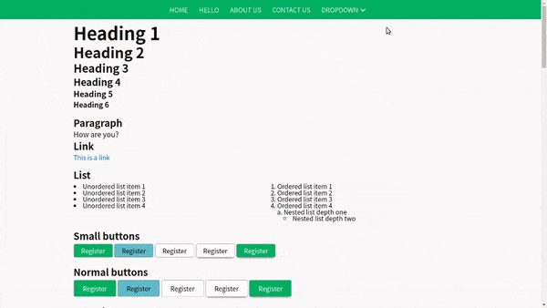

## Get started
1. Start by installing Sass on your computer from [here](https://github.com/sass/dart-sass/releases/tag/1.26.3). *Feel free to read up on Sass if you are unfamiliar with it.*
2. Clone this repository
    - If you just want to check out the project, you can open the index.html file in Chrome.
3. You can add/remove/edit partials in the main.scss file and compile the output using  
```sass --watch main.scss:output.css```

This will create an output.css file each time you make any changes to the referred partials or the main.scss file. Open the index.html file to see the results. I recommend creating a local server that automatically updates whenever any files in the folder are changed.

Current output.css file size is 12.5kb (**9.1kb minified**)  
Without the skeleton-css grid, the minified file size is **7.3kb**  
This size will definitely increase once cross-browser compatibility is added

## Why this project?
**This project is inspired by skeleton-css and Materialize CSS and looks to combine the best of both** to create a boilerplate CSS that can be extended in a variety of ways. 
* The focus is on being able to make different themes quickly for prototyping. This is super useful for designers and front-end devs to check how different color combinations might look before implementing them in their existing projects.
* Another important idea is to make the CSS as extensible as possible by keeping components decoupled. For example, if you don't require a dropdown in the navbar, you can simply comment out the ```partials/dropdown``` line in ```main.scss```. The same applies for all other components.
* The world has moved beyond framework-based grids. Although we have included (directly), the skeleton-css grid - you can always comment out the component from the ```main.scss``` file and use CSS Grids instead.

## Themes



This repository contains a few existing themes.
You can easily create new themes in the ```themes``` folder. Check out the existing themes to get an idea for how the themes are implemented. If you create a new theme, remember to update the main.scss file to refer to it.

### Ideas for creating themes
You can contribute by creating multiple themes for this project. A great tool to generate themes can be found here:
http://colormind.io/template/material-dashboard/

You can use the following guidelines to make a theme:
1) Use the center color for primary color
2) Use the color left of center for secondary color
3) Use the color right or extreme right of center for accent color
4) Use the color to the extreme left for base color  

Of course, you are free to mix and match as you please!

## How you can contribute
1. Add cross-browser compatibility
2. Improve the existing code
2. Remove redundancies in the existing code
3. Add more partials
    - Sidenav
    - Accordions
    etc.
4. Improve the index.html file to add documentation

## Credits
* This project is inspired by **skeleton-css**. The grid used is taken directly from [SkeletonCSS Github](https://github.com/dhg/Skeleton.)
* A color file is included along with this project, taken from the **Materialize CSS** project found [here](https://github.com/Dogfalo/materialize). To use the color classes, simply add this to the main.scss file:  
```@import "partials/color.scss"```  
You can find out how to use the color classes [here](https://materializecss.com/color.html).
Bear in mind that this increases the project size by 32.9kb!