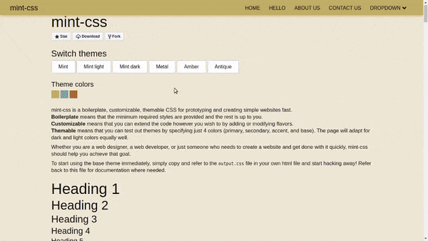

## Intro
mint-css is boilerplate CSS that you can use for prototyping, theming, or even use directly in your projects. 
It is useful for web designers as well as developers.

## Table of contents

* [Quickstart](#quickstart)
* [Themes and flavors](#themes-and-flavors)
* [What are flavors?](#what-are-flavors)
* [Why this project?](#why-this-project)
* [How you can contribute](#how-you-can-contribute)
* [Credits](#credits)

## Quickstart
*src = source code, build = final output, demo = demo webpage and documentation*
1. Download the latest release [here](https://github.com/Saunved/mint-css/releases)
2. Open the ```demo/default/index.html``` file
3. You will be able to view the predefined themes by using the "Switch theme" buttons, as shown in the GIF below

## Themes and flavors

Specify just 4 colors in your theme file and you're ready to go!  
Full support for dark themes and contrast-conscious typography.  



## What are flavors?
A flavor is a type of UI. E.g. "Material design" is a flavor, or "Flat" is a flavor. I decided not to call it a theme, since that term is used to define the color themes in this project. Flavors contain partials (css code for different UI elements). **All flavors share javascript components that add functionality to the css.**

You can create your own flavors. You can even copy and modify some partials from the existing flavors if you wish to. To start creating flavors quickly, you can create a copy of the existing ```blueprint``` flavor, and modify it however you wish to. You can refer to the ```default``` flavor to get an idea of the implementation.

A list of class names that you should ideally retain for consistency is provided in this file: [docs/class-list.md](./docs/class-list.md).

## Why this project?
* The focus is on being able to make different themes based on various color palettes for prototyping. This is super useful for designers and front-end devs to check how different color combinations might look before implementing them in their existing projects.

* Ever gotten *tired* of the way a framework looks and want to spice things up by changing the UI? Switching over to a new framework or design style requires constantly going back and forth between the documentation and the code and renaming classes and fixing dependencies. **Flavors** will allow people to create unique "UI kits" while retaining most class names and reusing partials and components across flavors.

* Most CSS frameworks (and boilerplates) do not come with good support for dark themes or contrast-conscious typography. These have to be hand-written. This is taken care of by a few if/else statements in sass to check for lightness (HSL) values.

* Allowing people to spin up a good-looking website in record time with all the essential elements styled and a small CSS file size was always an aim.

* Another important idea is to make the CSS as customizable as possible For example, if you aren't going to use any forms, you can simply comment out the partials/form line in src/main.scss. This is already available in existing frameworks like Bootstrap and Materialize.

* A consistent class naming system will allow various flavors to be interchangeable, giving us the ability to adapt to new flavors quickly. Although this cannot be enforced, we can take good care to use the ```docs/class-list``` file for any classes that we might require.

* The world has moved beyond framework-based grids. I have included the skeleton-css grid directly in the project, but you can always comment out the ```_grid.scss``` partial from the ```./src/flavors/flavor-name``` folder and use CSS Grids instead.

## How you can contribute
Refer to the [CONTRIBUTING.md file](https://github.com/Saunved/mint-css/blob/master/CONTRIBUTING.md)

## Credits
* This project is inspired by **skeleton-css**. The grid used is taken directly from [SkeletonCSS Github](https://github.com/dhg/Skeleton.)
* A color file is included along with this project, taken from the **Materialize CSS** project found [here](https://github.com/Dogfalo/materialize). To use the color classes, simply add this to the main.scss file:  
```@import "partials/color.scss"```  
You can find out how to use the color classes [here](https://materializecss.com/color.html).
Bear in mind that this increases the project size by 32.9kb!