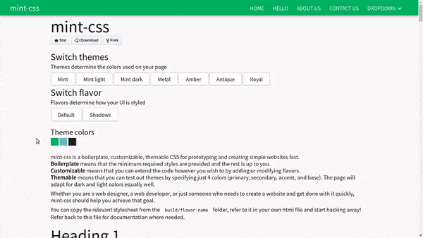

## Intro
mint-css lets you change how every single component of your website looks by changing one stylesheet. Make redesigning instant.

<p align="center">
  
</p>

Use for prototyping, theming or directly in your projects. View a live demo here: [mint-css demo](https://saunved.github.io/mint-css).  
The backbone of this project is the ```docs/class-list.md``` file, which you can find [here](./docs/class-list.md).

## Table of contents

* [Quickstart](#quickstart)
* [Color themes](#color-themes)
* [What are flavors?](#what-are-flavors)
* [Why this project?](#why-this-project)
* [How you can contribute](#how-you-can-contribute)
* [Credits](#credits)

## Quickstart
You can view the project live here: [mint-css demo](https://saunved.github.io/mint-css)

1. To view offline, download the latest release [here](https://github.com/Saunved/mint-css/releases)
2. Open the ```docs/index.html``` file

## Color themes

**Themes determine the colors used in your application.**
You can define these colors yourself.
All styling is created with dark themes and contrast conscious colors in mind.

## What are flavors?
**Flavors determine how your UI is styled.**  

The idea behind flavors is simple:  
**If you want to change your website's UI (say from Material to Flat), all you have to do to is change one stylesheet reference.** This can be achieved by maintaining a consistent set of CSS classes across flavors. This class list can be found [here](./docs/class-list.md)

Flavors contain partials (css code for different UI elements) and *usually* share javascript components. You can create your own flavors. You can even copy and modify some partials from the existing flavors. To start creating flavors quickly, you can create a copy of any of the existing flavors and modify it however you wish to. You can refer to the ```default``` flavor to get an idea of the implementation.

## Why this project?
* The focus is on being able to make different themes based on various color palettes for prototyping. This is super useful for designers and front-end devs to check how different color combinations might look before implementing them in their existing projects.

* Ever gotten *tired* of the way a framework looks and want to spice things up by changing the UI? Switching over to a new framework or design style requires constantly going back and forth between the documentation and the code and renaming classes and fixing dependencies. **Flavors** will allow people to create unique "UI kits" while retaining most class names and reusing partials and components across flavors.

* Most CSS frameworks (and boilerplates) do not come with good support for dark themes or contrast-conscious typography. These have to be hand-written. This is taken care of by a few if/else statements in sass to check for lightness (HSL) values.

* Allowing people to spin up a good-looking website in record time with all the essential elements styled and a small CSS file size was always an aim.

* Another important idea is to make the CSS as customizable as possible For example, if you aren't going to use any forms, you can simply comment out the partials/form line in src/main.scss. This is already available in existing frameworks like Bootstrap and Materialize.

* A consistent class naming system will allow various flavors to be interchangeable, giving us the ability to adapt to new flavors quickly. Although this cannot be enforced, we can take good care to use the ```docs/class-list``` file for any classes that we might require.

## How you can contribute
Refer to the [CONTRIBUTING.md file](https://github.com/Saunved/mint-css/blob/master/CONTRIBUTING.md)

## Credits
* This project is inspired by **skeleton-css**. [SkeletonCSS Github](https://github.com/dhg/Skeleton.)
* Some scss color files are included along with this project, taken from the **Materialize CSS** project found [here](https://github.com/Dogfalo/materialize). To use the color classes, simply add this to the ```src/flavors/flavor-name/flavor-name.scss``` file:  
```@import "partials/color.scss"```  
You can find out how to use the color classes [here](https://materializecss.com/color.html).
Bear in mind that this increases the project size by 32.9kb!